<div align="center">


<br/><br/>

# 🔐 SC-300 Lab 01 — Managing User Roles in Microsoft Entra ID

### A hands-on portfolio record of what I built, observed, practiced, and learned — with concept explanations at every step


</div>

---

## 👋 Who This Is For & What This Covers

This repository is my personal, hands-on record of completing **SC-300 Lab 01** inside a live Microsoft Azure environment. Every step is backed by a real screenshot I took, and every action is paired with a concept explanation so that anyone reading this understands not just *what* I did, but *why it works that way*.

**Topics covered:**
- How Microsoft Entra ID manages users and identities
- Role-Based Access Control (RBAC) in practice
- Privileged Identity Management (PIM) for secure role assignment
- Bulk user provisioning via CSV upload and PowerShell scripting
- The Microsoft Graph API as the engine behind everything
- Full user lifecycle — create → assign → modify → delete → restore
- Microsoft 365 license management and its prerequisites

---

## 📋 Table of Contents

| # | Section |
|---|---|
| 1 | [🌐 Environment and Core Concepts](#-environment-and-core-concepts) |
| 2 | [🏗 Exercise 1 — Create a User and Test Default Permissions](#-exercise-1--create-a-user-and-test-default-permissions) |
| 3 | [🛡 Exercise 2 — Assign a Role and Watch Access Change Live](#-exercise-2--assign-a-role-and-watch-access-change-live) |
| 4 | [🗑 Exercise 3 — Remove a Role via the Role Blade](#-exercise-3--remove-a-role-via-the-role-blade) |
| 5 | [📦 Exercise 4 — Bulk Provisioning via CSV and PowerShell](#-exercise-4--bulk-provisioning-via-csv-and-powershell) |
| 6 | [♻️ Exercise 5 — Delete and Restore a User](#️-exercise-5--delete-and-restore-a-user) |
| 7 | [🪪 Exercise 6 — Assign a Windows 10/11 License](#-exercise-6--assign-a-windows-1011-license) |
| 8 | [🧠 What I Learned](#-what-i-learned) |
| 9 | [⚡ PowerShell Quick Reference](#-powershell-quick-reference) |
| 10 | [✅ Lab Completion Record](#-lab-completion-record) |

---

## 🌐 Environment and Core Concepts

### The Tenant

A **tenant** in Microsoft Entra ID is a private, isolated directory belonging to one organisation. It holds all users, groups, applications, devices, and policies for that organisation and nothing crosses the boundary unless explicitly configured.

```
Tenant : Contoso
Domain : LODSM016355.onmicrosoft.com
```

### Portals Used

| Portal | URL | Owns |
|---|---|---|
| **Microsoft Entra Admin Center** | `entra.microsoft.com` | Identity — users, roles, groups, PIM, apps |
| **Microsoft 365 Admin Center** | `admin.microsoft.com` | Billing — licenses and subscriptions |

> These portals are not interchangeable. License assignment can only be done in M365 Admin Center. Role assignment and user creation live in Entra ID.

### Key Concepts

**Role-Based Access Control (RBAC)** — permissions are assigned to roles, users are assigned to roles. Over 100 built-in roles exist in Entra ID. New users start with zero permissions — every access must be explicitly granted.

**Privileged Identity Management (PIM)** — a Premium P2 feature that adds governance on top of role assignment. Every assignment requires a written justification, is timestamped, logged, and can be time-bound. Roles can be **Active** (always on) or **Eligible** (activated on demand).

**Microsoft Graph API** — the single unified REST API (`https://graph.microsoft.com`) behind everything in Entra ID. Every portal click is a Graph API call. Every PowerShell cmdlet is a Graph API call. Same system, two interfaces.

**Soft Delete** — deleted users enter a recoverable bin for **30 days** before permanent removal. Object ID, group memberships, and app assignments are all preserved during this window.

---

## 🏗 Exercise 1 — Create a User and Test Default Permissions

### What I Did

Signed in as Global Administrator, created a new internal user — **Chris Green** — then signed in as Chris Green in an InPrivate window to observe what a zero-permission account can and cannot do.

---

### Step 1 — Sign In as Global Administrator

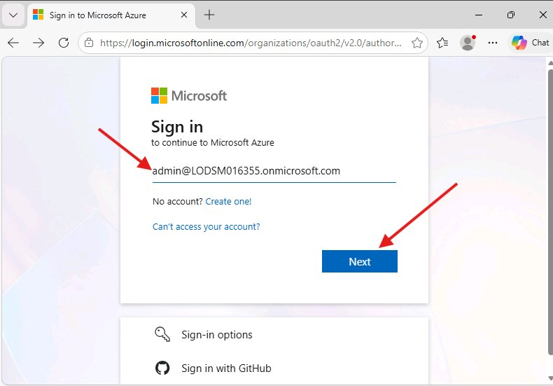

> I signed in with `admin@LODSM016355.onmicrosoft.com` — the MOD Administrator account holding the Global Administrator role. The `onmicrosoft.com` domain is the default Microsoft assigns to every new tenant.

---

### Step 2 — The Contoso Tenant Dashboard

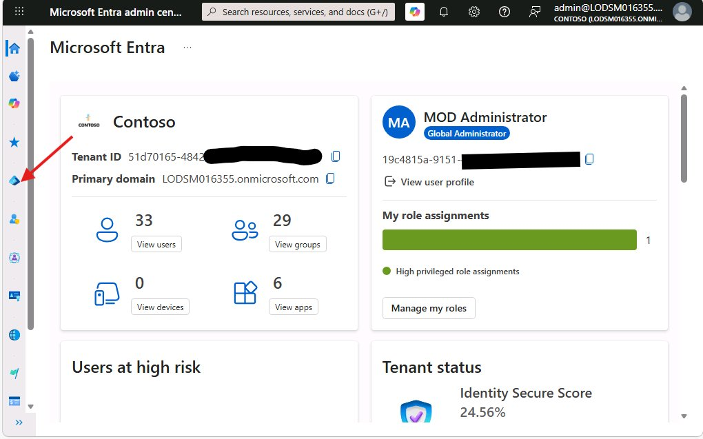

> The dashboard shows 33 users, 29 groups, 0 devices, and 6 apps. My account has 1 high-privileged role assignment — Global Administrator. The Identity Secure Score of 24.56% is a Microsoft-calculated metric reflecting how well the tenant's security settings align with best practices.

---

### Step 3 — Navigate to Create New User

In the left navigation: **Entra ID → Users → All Users → + New user → Create new user**

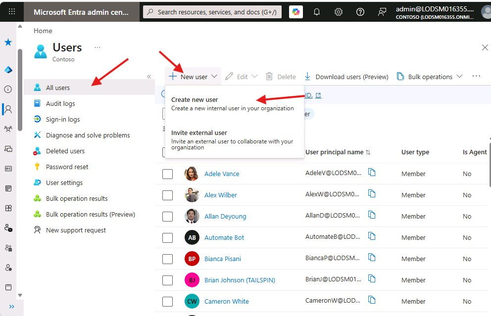

> Two options exist — *Create new user* (internal account, lives entirely in this tenant) and *Invite external user* (guest account linked to an identity in another organisation). Chris Green is a new Contoso employee — internal is the correct choice. Choosing the wrong type at onboarding creates lifecycle management problems later.

---

### Step 4 — Fill In User Details

| Field | Value | Why It Matters |
|---|---|---|
| **User principal name** | `ChrisG` | Becomes `ChrisG@LODSM016355.onmicrosoft.com` — the login identifier, must be unique across the tenant |
| **Display name** | `Chris Green` | Shown in directory, emails, and portal |
| **Auto-generate password** | ✅ Enabled | Temporary — user must change it on first login. Copy it before leaving this screen. |

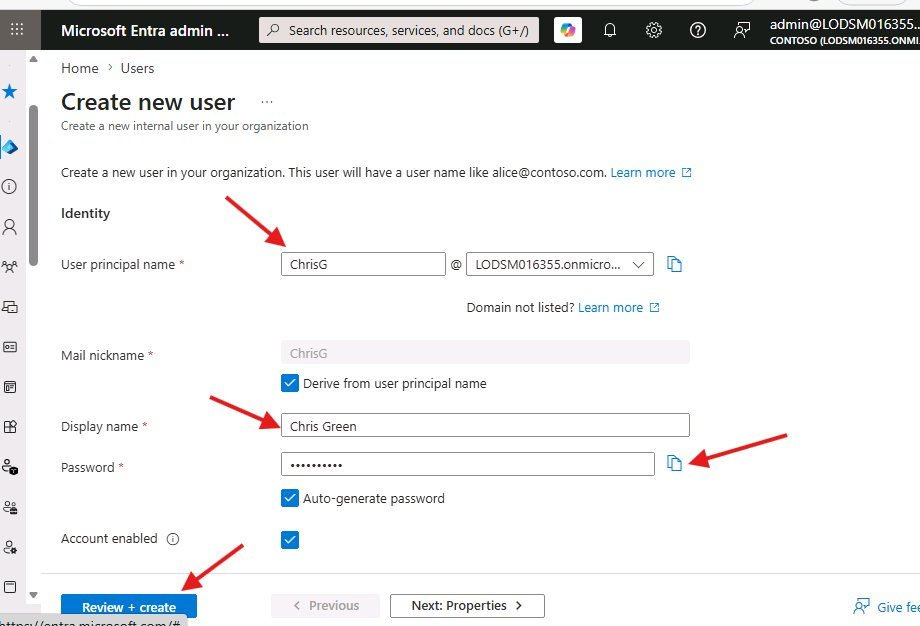

> The UPN is the primary login identifier and is used by external systems to reference this user's identity. Changing a UPN later can break application integrations. Small decision, real consequences.

I clicked **Review + Create → Create**. ✅ Chris Green now exists in the Contoso directory.

---

### Step 5 — Sign In as Chris Green (InPrivate Window)

To test Chris Green's perspective without logging out of my admin session, I opened a separate **InPrivate browser window** — a completely isolated session with no shared cookies or cached credentials.

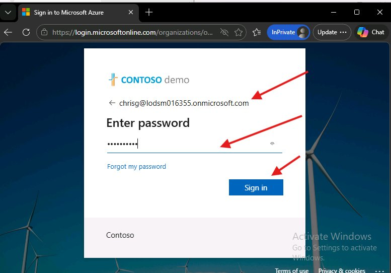

> Browsers share session cookies across tabs. Without InPrivate, the portal would still reflect admin permissions. InPrivate creates a genuinely separate session — essential for accurately testing what a different user sees.

---

### Step 6 — Mandatory First-Login Password Change

On first login, the portal immediately blocked access and forced a password change. Auto-generated passwords are treated as temporary.

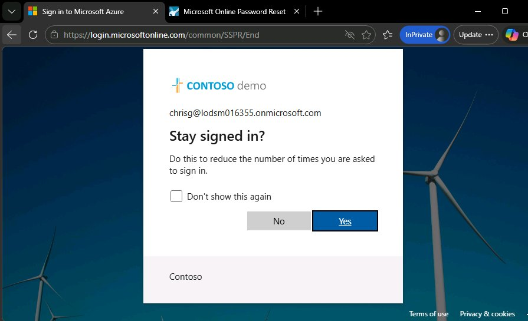

> The admin never needs to know the user's final password. The user sets their own — the admin only provided the temporary one.

---

### Step 7 — Stay Signed In Prompt

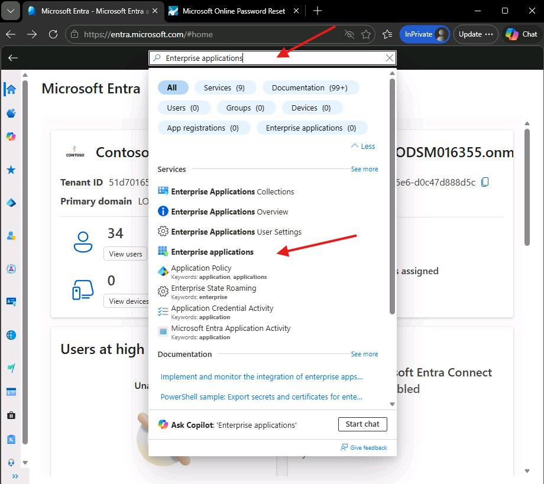

> "Yes" stores a Persistent Refresh Token, reducing re-authentication frequency. On a shared or public machine, "No" is correct.

---

### Step 8 — Search for Enterprise Applications as Chris Green

Inside the portal as Chris Green, I searched for **Enterprise Applications**.

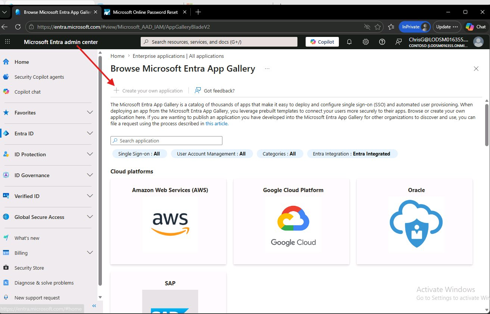

> Notice the search counters — Users (0), Groups (0), Devices (0). Chris Green cannot enumerate other users or groups in the directory. He has no role that grants that access. RBAC is already at work.

---

### Step 9 — Attempt to Create an App — Blocked

I clicked **+ New Application** to try creating an enterprise app.

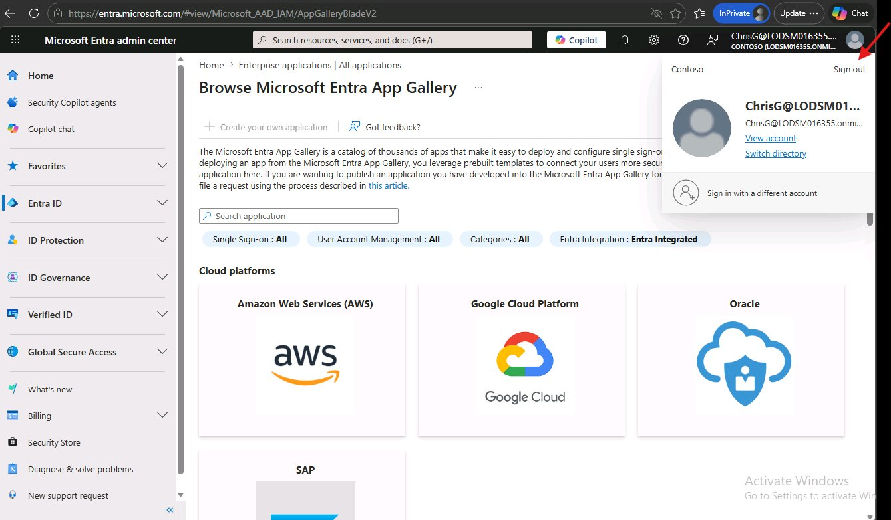

> "Create your own application" is completely greyed out. The portal is performing a real-time authorisation check against the live directory and rendering the interface based on what Chris Green is allowed to do. He has no role — so the write action is locked.
>
> **This is Least Privilege as a default.** Not a setting someone configured — the baseline state of every new account. Every access must be explicitly granted.

---

### Step 10 — Sign Out of Chris Green's Session

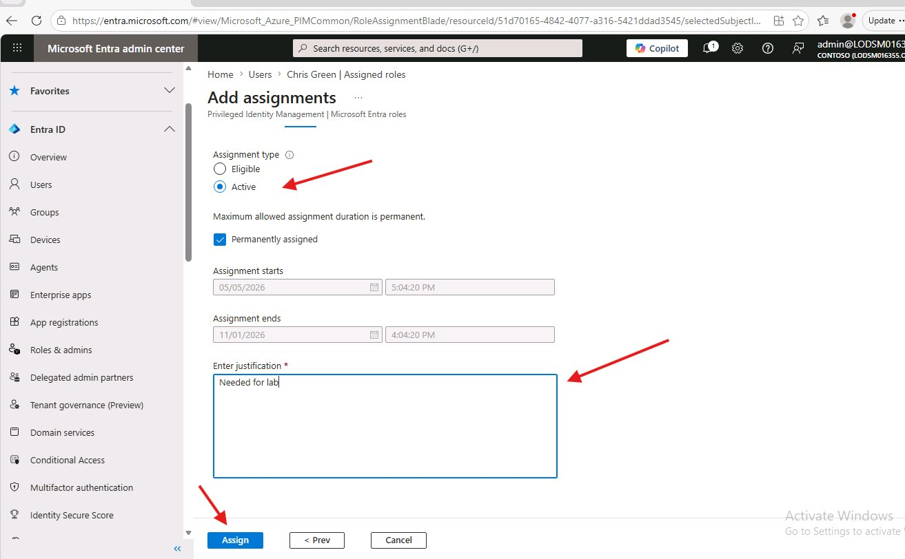

---

### What I Practiced and Demonstrated

- Creating an internal user with UPN, display name, and auto-generated password
- Understanding the difference between internal and external/guest user creation
- Using InPrivate windows to simultaneously test two different user sessions
- Observing how the portal enforces RBAC in real time — locked actions are access-controlled at the directory level, not just hidden in the UI

---

## 🛡 Exercise 2 — Assign a Role and Watch Access Change Live

### What I Did

Assigned the **Application Administrator** role to Chris Green via PIM, then immediately verified from his session that the permission change propagated.

### Understanding the Role Being Assigned

| Application Administrator Can Do | Cannot Do |
|---|---|
| ✅ Create and manage enterprise applications | ❌ Create or delete users |
| ✅ Configure SSO for apps | ❌ Reset user passwords |
| ✅ Create app registrations | ❌ Manage other admin roles |
| ✅ Configure app permissions and consent | ❌ Access Azure subscription resources |
| ✅ Manage service principals | ❌ Read other users' full profiles |

This scoping is deliberate. Least privilege means giving someone exactly what they need and nothing more.

---

### Step 1 — Select the Application Administrator Role

In my admin session: **Chris Green's profile → Assigned roles → + Add assignments**

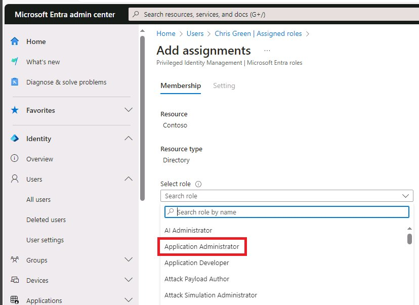

> The panel header reads "Privileged Identity Management | Microsoft Entra roles" — confirming PIM is handling this, not the basic role assignment flow. PIM is enabled in this tenant, which means extra governance steps that mirror a real enterprise environment.

---

### Step 2 — Configure the PIM Assignment

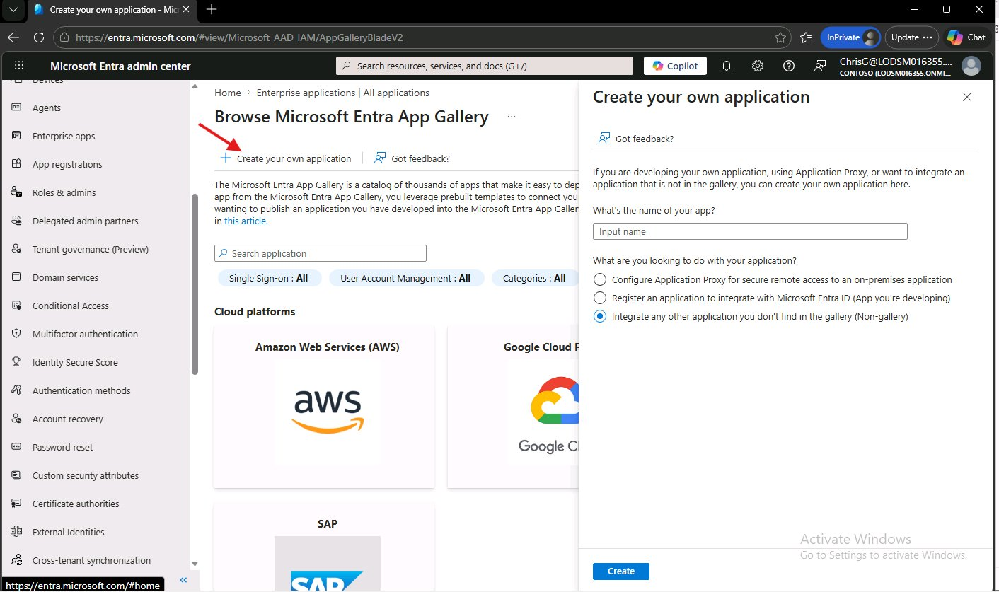

> **Three critical decisions:**
>
> **Assignment type: Active** — I chose Active rather than Eligible. Eligible would require Chris Green to self-activate the role every time he needs it. Active means it is always on.
>
> **Permanently assigned** — No automatic expiry. In a real organisation a 90 or 180-day expiry with re-justification at renewal would be more secure.
>
> **Justification: "Needed for lab"** — PIM mandates a written reason for every privileged role assignment, stored permanently in the audit log. In a real environment this would reference a ticket number or manager approval.

I clicked **Assign**.

---

### Step 3 — Verify from Chris Green's Session

I opened a new InPrivate window, signed in as Chris Green, and navigated to Enterprise Applications → + New Application.

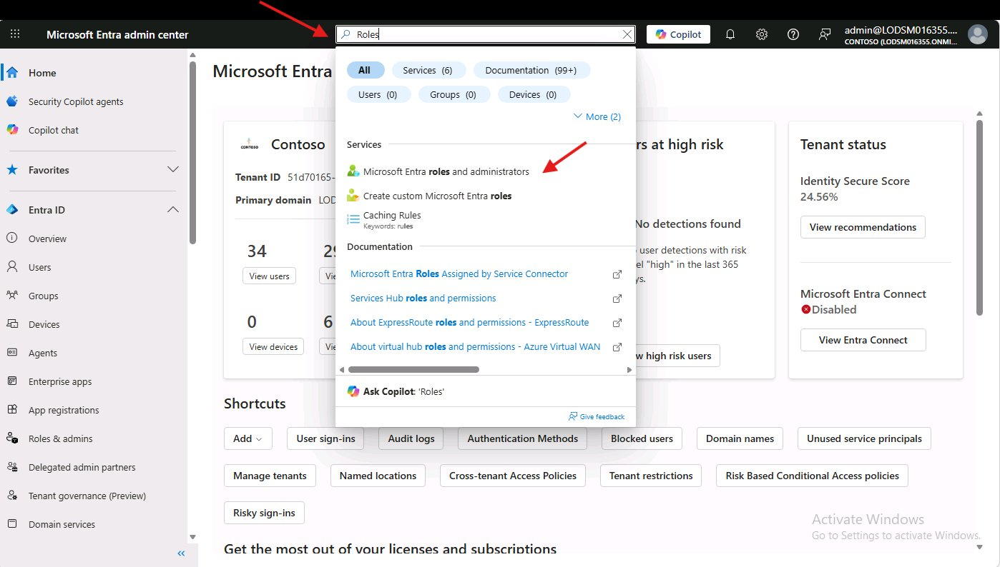

> "Create your own application" is now fully clickable and the complete application creation panel appeared. The only thing that changed was the role assignment I made in the admin session.
>
> The change propagated within seconds. No re-login required. Entra ID does not bake permissions into the session token at login — it checks authorisation continuously against the live directory. Role changes take effect almost immediately.

---

### What I Practiced and Demonstrated

- Understanding the difference between Eligible and Active PIM assignments
- Writing a justification for a privileged role assignment
- Confirming RBAC changes propagate without requiring the user to re-authenticate
- Seeing the portal render a different interface based on live permission state

---

## 🗑 Exercise 3 — Remove a Role via the Role Blade

### What I Did

Removed Chris Green's Application Administrator role using the **Roles and Administrators** blade — approaching removal from the role's perspective rather than the user's profile.

### Why This Approach Matters

The role blade shows every holder of a given role across the entire directory in one view. In an organisation with hundreds of users, navigating into each profile individually is not scalable. The role-centric approach is the operationally realistic one.

---

### Step 1 — Search for Roles and Administrators

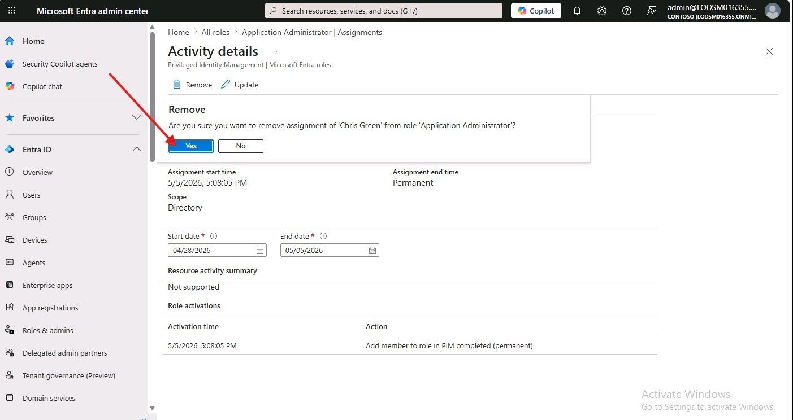

> The search returns "Microsoft Entra roles and administrators" as the first result — this is the All Roles view where every role and its current assignments can be managed.

---

### Step 2 — Open Chris Green's Assignment Details

From the All Roles list I clicked **Application administrator**, found Chris Green, and opened his Activity details.

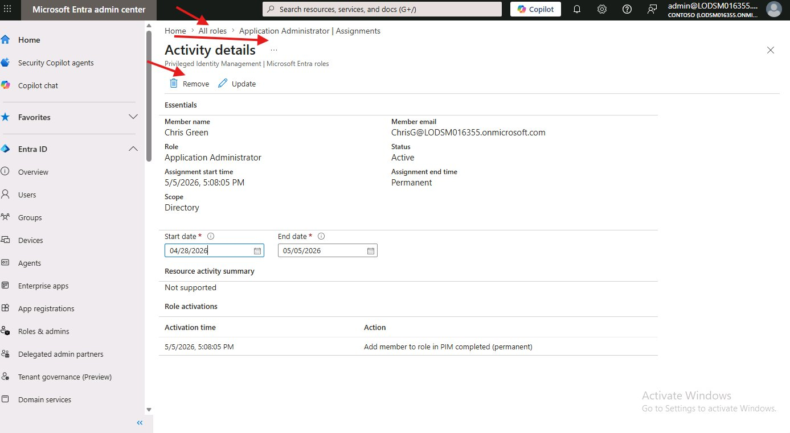

> The Activity details panel shows the complete record — member name, role, status (Active), assignment start time, end time (Permanent), scope (Directory). The Role activations section logs the exact action: "Add member to role in PIM completed (permanent)."
>
> This audit record is permanent. Even after the role is removed, this log entry remains. PIM records cannot be deleted.

---

### Step 3 — Confirm the Removal

I clicked **Remove** and confirmed.

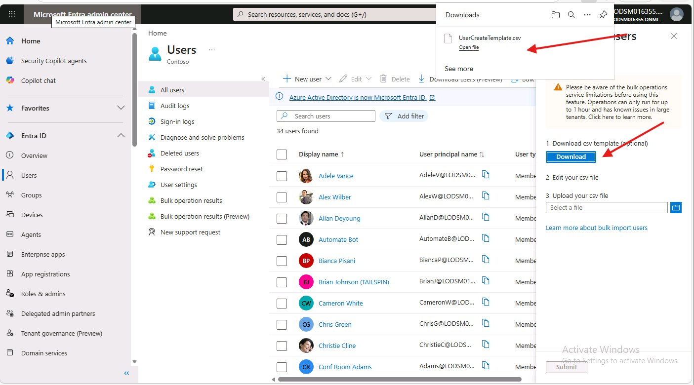

> The confirmation dialog shows the full context before committing — who is being removed, which role, when it was assigned. This intentional friction prevents accidental revocations.

✅ Application Administrator role removed from Chris Green.

---

### What I Practiced and Demonstrated

- Managing role assignments from the role's perspective — the scalable approach
- Reading and interpreting PIM Activity details including scope, timestamps, and activation log
- Understanding that PIM audit records are permanent — removal is logged just as assignment was

---

## 📦 Exercise 4 — Bulk Provisioning via CSV and PowerShell

### What I Did

Provisioned 10 new users across Sales and Marketing using two methods: a CSV bulk upload through the portal, and user creation via PowerShell and the Microsoft Graph SDK.

---

### Task A — Bulk Create via CSV

#### Step 1 — Download the CSV Template

Navigated to **Identity → Users → All Users → Bulk operations → Bulk create → Download**


> The CSV template has a specific structure. Row 1 is a version header — do not modify. Row 2 is column headers. Data starts on row 3. Required fields: display name, UPN (full `user@domain.com` format), initial password, and block sign-in flag.

---

#### Step 2 — Edit the CSV in Notepad

I opened `SC300BulkUser.csv` in Notepad and replaced the placeholder domain with the live tenant domain.

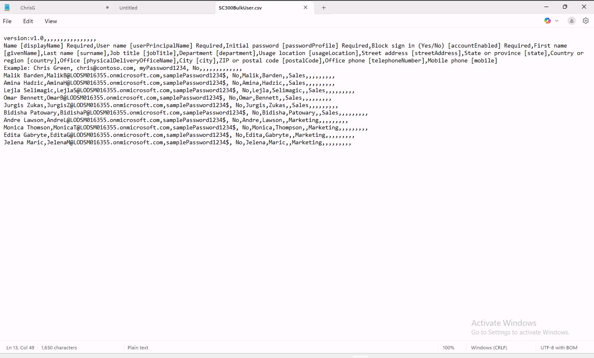

> All 10 users use `samplePassword1234$` as their initial password — required to be changed on first login. `accountEnabled` is set to `No` for all rows — accounts are created in a disabled state and must be enabled before users can sign in.

| Name | Department |
|---|---|
| Malik Barden | Sales |
| Amina Hadzic | Sales |
| Lejla Selimagic | Sales |
| Omar Bennett | Sales |
| Jurgis Zukas | Sales |
| Bidisha Patowary | Sales |
| Andre Lawson | Marketing |
| Monica Thomson | Marketing |
| Edita Gabryte | Marketing |
| Jelena Maric | Marketing |

---

#### Step 3 — Upload the CSV and Submit

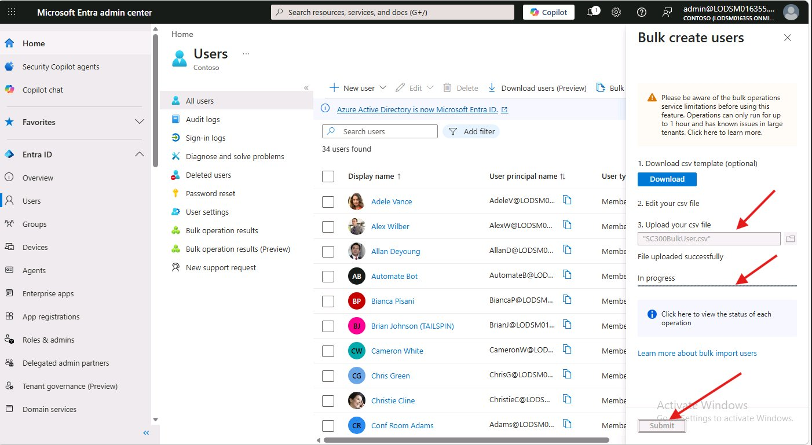

> "File uploaded successfully" confirms the file passed Entra's format validation before being queued. The Submit button became active only after validation passed.

---

#### Step 4 — Monitor the Operation

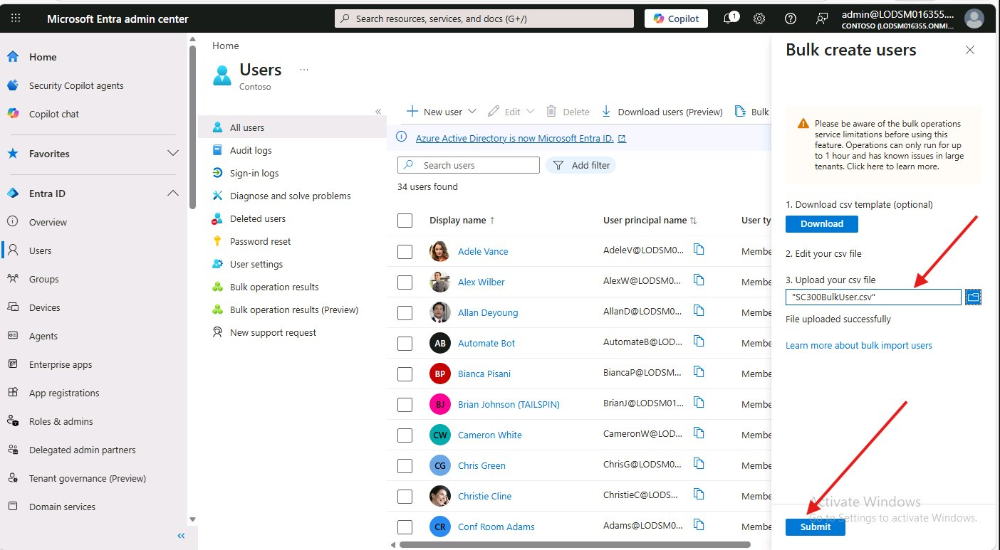

> Bulk operations run asynchronously. The portal does not block while they process. For large imports this background processing can take several minutes.

---

#### Step 5 — Verify Results

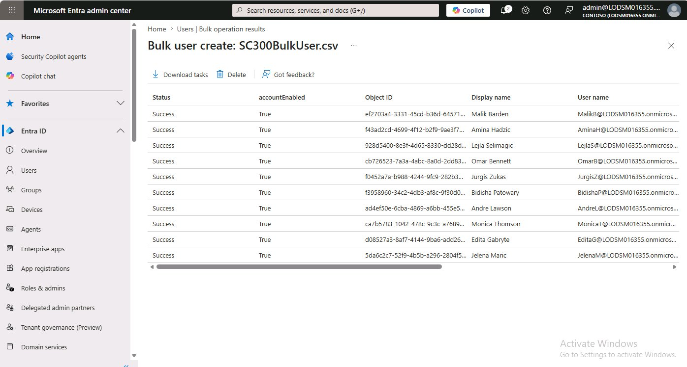

> Every row shows Status: **Success** with an **Object ID** assigned by Entra ID. The Object ID is the internal, immutable identifier for a directory object — it never changes even if the UPN, display name, or department changes. It is the stable reference used by the Graph API, PIM, and audit logs to track an identity across its entire lifetime.

---

### Task B — Bulk Add via PowerShell (Microsoft Graph SDK)

**The key insight:** Every portal click is a Microsoft Graph API call. Every PowerShell cmdlet is a Microsoft Graph API call. Same directory, different interface. Anything the portal can do, a script can automate.

---

#### Step 1 — Upgrade PowerShell to Version 7

The Microsoft.Graph module requires PowerShell 7.2+. My version was 5.1 — too old.

```powershell
winget install --id Microsoft.PowerShell --source winget
```

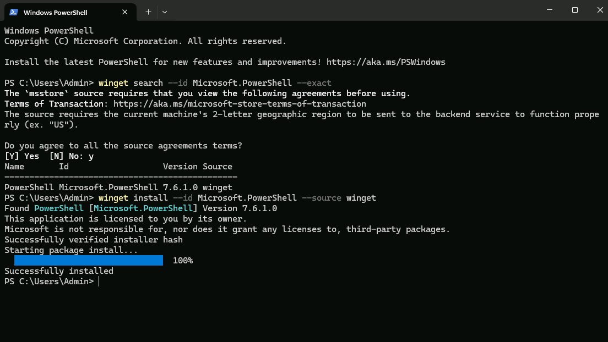

> winget handles the download, hash verification, and installation in a single command. The same command always installs the same verified version.

---

#### Step 2 — Install the Microsoft.Graph Module

```powershell
Install-Module Microsoft.Graph -Scope CurrentUser -Verbose
Get-InstalledModule Microsoft.Graph
```

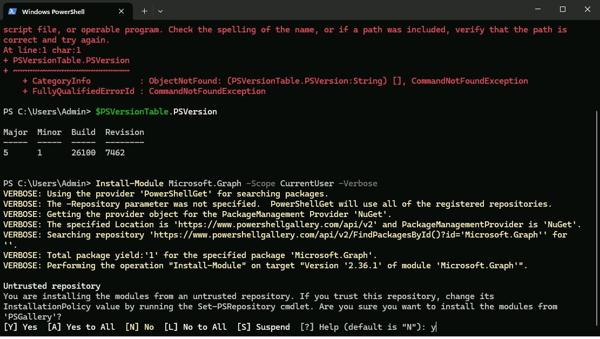

> `-Scope CurrentUser` installs for my account only — no system admin privileges needed. The "Untrusted repository" prompt is standard for PSGallery — type `Y` to proceed. A warning appeared that version 2.19.0 was already present; the installer offered to install 2.36.1 side-by-side.

---

#### Step 3 — Connect to Microsoft Graph

```powershell
Connect-MgGraph -Scopes "User.ReadWrite.All"
```

This opens a browser-based OAuth 2.0 flow requesting **delegated permissions** — the script acts on behalf of the signed-in admin, not as an independent application.

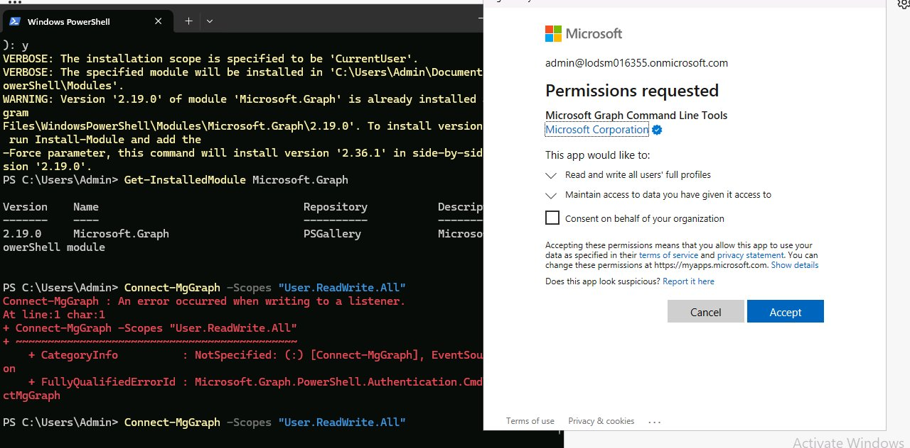

> **Delegated vs Application permissions:** Delegated means the script can only do what I can do as the signed-in admin. Application permissions allow the script to act independently of any signed-in user. For admin operations run by a human, delegated is the correct choice.

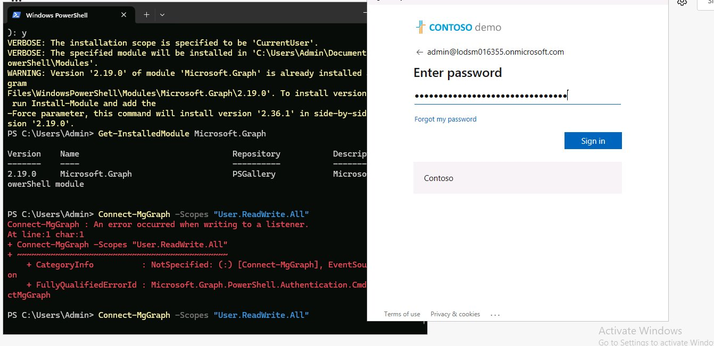

---

#### Step 4 — Verify Connection and List Tenant Users

```powershell
Get-MgUser
```

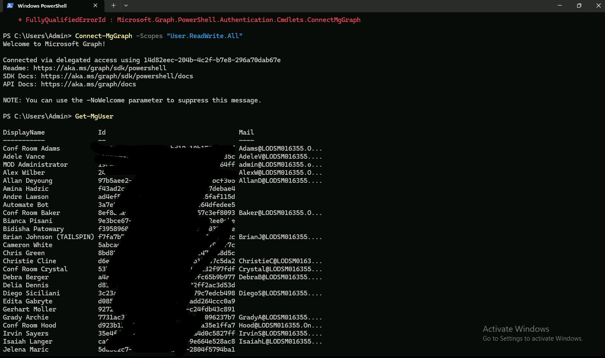

> "Welcome to Microsoft Graph!" confirms the authenticated session. `Get-MgUser` returns every user in the tenant — the same users visible in the Entra portal. Same directory, same data, different interface.

---

#### Step 5 — Create a New User via Script

```powershell
$PWProfile = @{
    Password                      = "<complex password>"
    ForceChangePasswordNextSignIn = $false
}

New-MgUser `
    -DisplayName       "New PW User" `
    -GivenName         "New" -Surname "User" `
    -MailNickname      "newuser" `
    -UsageLocation     "US" `
    -UserPrincipalName "newuser@LODSM016355.onmicrosoft.com" `
    -PasswordProfile   $PWProfile -AccountEnabled `
    -Department        "Research" -JobTitle "Trainer"
```

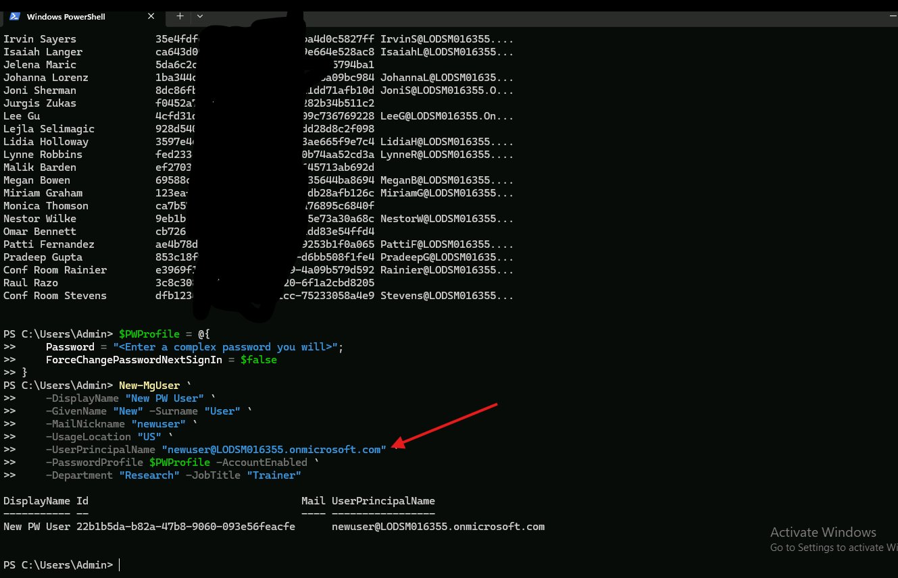

> The terminal returned the new user's DisplayName, Object ID (`22b1b5da-b82a-47b8-9060-093e56feacfe`), and UPN. That user was immediately visible in the Entra portal — no sync delay.
>
> The red error at the top is from a failed first `Connect-MgGraph` attempt due to a listener error. I ran the command again and it succeeded. I left it in because that is what actually happened.

---

### What I Practiced and Demonstrated

- Understanding the required structure of the Entra bulk create CSV template
- Performing and verifying a 10-user bulk import through the portal
- Upgrading PowerShell from 5.1 to 7.6.1 using winget
- Installing the Microsoft.Graph module from PSGallery
- Authenticating to a live Azure tenant using delegated OAuth permissions via Graph SDK
- Differentiating between delegated and application permissions
- Constructing a full `New-MgUser` command with all key properties
- Troubleshooting a live `Connect-MgGraph` listener error in real time

---

## ♻️ Exercise 5 — Delete and Restore a User

### What I Did

Deleted Chris Green to simulate an off-boarding, then recovered him from the soft-delete bin to simulate a reversed decision.

### Understanding Soft Delete

```
Active User → Delete → Soft-Deleted (recoverable, 30 days) → Permanent Deletion (day 31+)
```

During the 30-day soft-delete window:
- Account **cannot sign in**
- **License is released** (cost freed)
- **Object ID is preserved** — group memberships and app assignments remain intact
- **Full restoration is possible**

After 30 days the Object ID is destroyed. A new account with the same UPN gets a brand-new Object ID — no previous history, no restored memberships.

---

### Step 1 — Select Chris Green for Deletion

In All Users I used the **checkbox** to select Chris Green — not clicking his name link.

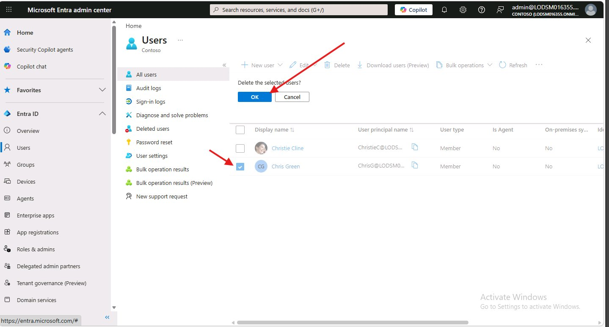

> Clicking the name opens the user's profile page where toolbar actions are limited. The checkbox activates the bulk-action toolbar — the correct pattern for operations intended to work at scale across multiple users.

---

### Step 2 — Confirm the Deletion

I clicked **Delete** and confirmed with OK.

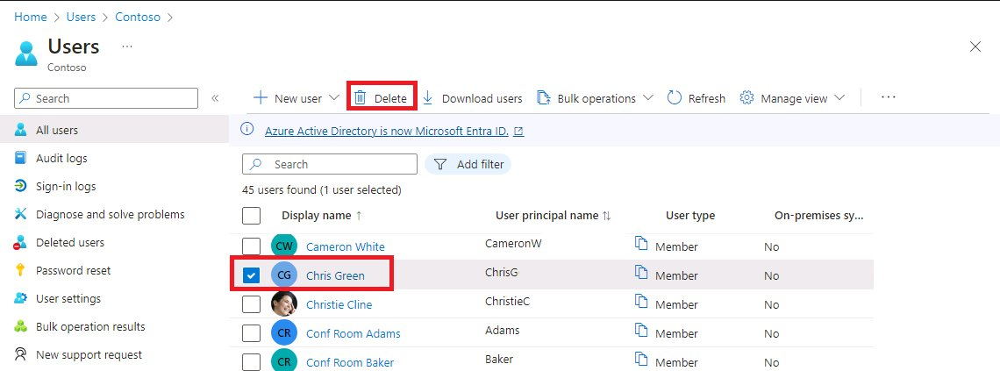

> This is a soft-delete — Chris Green moved to the Deleted users bin, not permanently removed.

---

### Step 3 — Restore from Deleted Users

I clicked **Deleted users** in the left navigation.

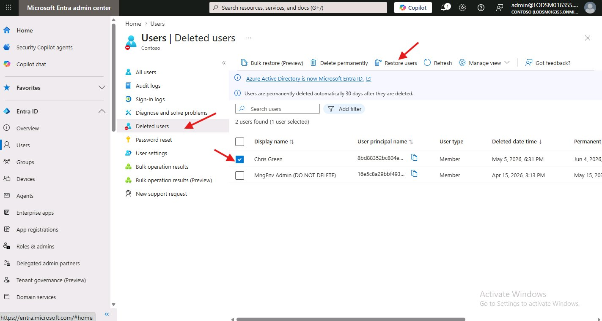

> Chris Green appears with his deletion timestamp (May 5, 2026, 6:31 PM) and his permanent deletion date (Jun 4, 2026 — exactly 30 days later). The portal makes this deadline completely explicit. A second account — "MngEnv Admin (DO NOT DELETE)" — is also visible, a lab service account accidentally soft-deleted at some point.
>
> I selected Chris Green and clicked **Restore users** from the toolbar. He returned to All Users with the same Object ID, meaning all group memberships and app relationships were restored alongside the account.

---

### Bonus — Admin-Initiated Password Reset

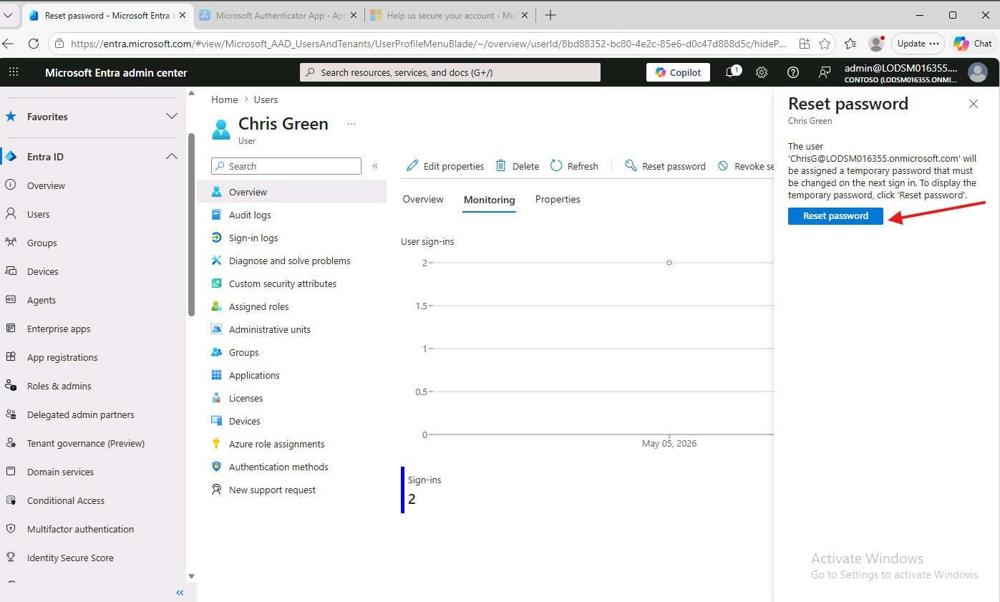

> The panel confirms: a temporary password will be assigned that must be changed on next sign-in. The admin never sees the user's actual password. A standard helpdesk operation.

---

### What I Practiced and Demonstrated

- Understanding soft delete vs. hard delete and the 30-day recovery window
- Using the checkbox selection pattern to activate bulk-action toolbar operations
- Navigating to the Deleted users view and identifying the permanent deletion deadline
- Restoring a soft-deleted user account with Object ID and relationships intact
- Performing an admin-initiated password reset

---

## 🪪 Exercise 6 — Assign a Windows 10/11 License

### What I Did

Assigned a Windows 10/11 Enterprise E3 license to **Raul Razo** via the Microsoft 365 Admin Center, then verified in Entra ID.

### Why Licensing Lives in a Different Portal

**Identity** (who you are, what role you hold) → **Microsoft Entra ID**
**Licensing** (what software you can access) → **Microsoft 365 Admin Center**

Entra ID can *display* license state but **cannot change it**. This is intentional — identity is a security concern, licensing is a commercial concern.

> [!WARNING]
> A user must have a **Usage Location** set on their profile before any license can be assigned. Without it, the assignment either fails silently or throws an error. Always verify Usage Location first.

---

### Step 1 — Search for Raul Razo

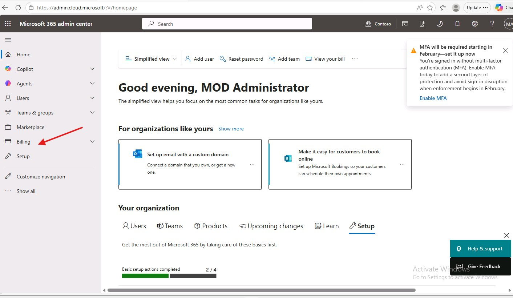

> I confirmed Raul Razo had a Usage Location set before proceeding. The search returned 1 user found — Raul Razo — selected via checkbox.

---

### Step 2 — Open the Microsoft 365 Admin Center

I opened a new browser tab and navigated to `admin.microsoft.com`.

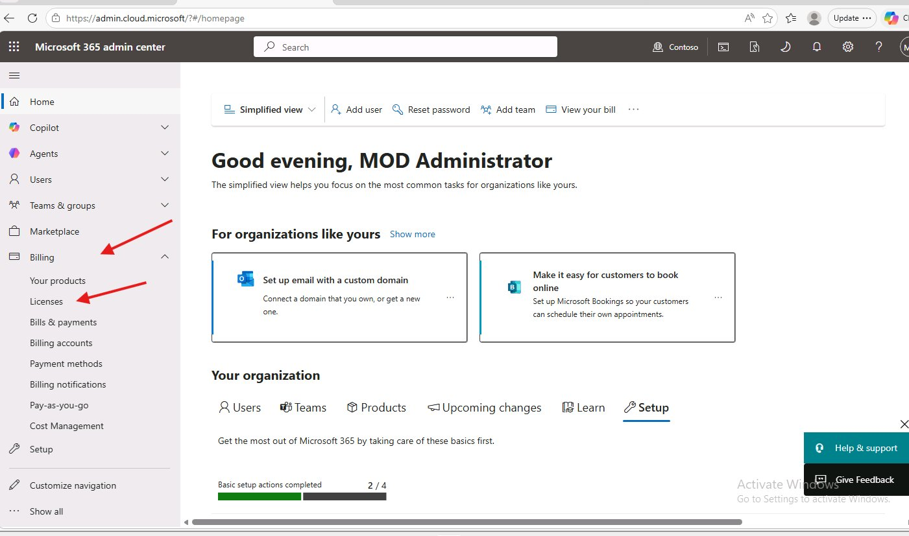

---

### Step 3 — Navigate to Billing → Licenses

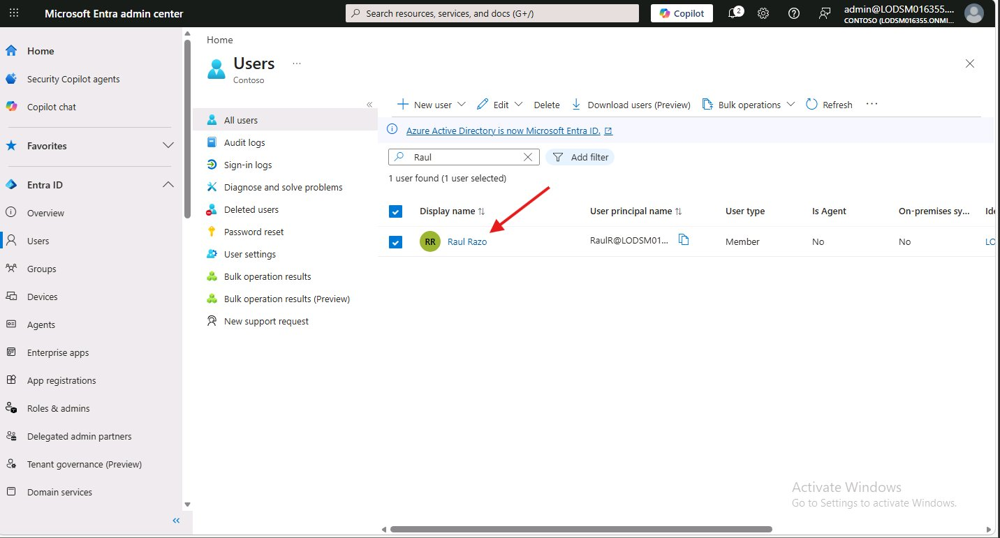

> The Billing section lists your products, licenses, bills and payments, billing accounts, payment methods, billing notifications, pay-as-you-go, and cost management. License management lives under **Licenses**.

---

### Step 4 — Assign Windows 10/11 Enterprise E3 to Raul Razo

I selected **Windows 10/11 Enterprise E3** and clicked **+ Assign licenses**, then searched for and selected Raul Razo.

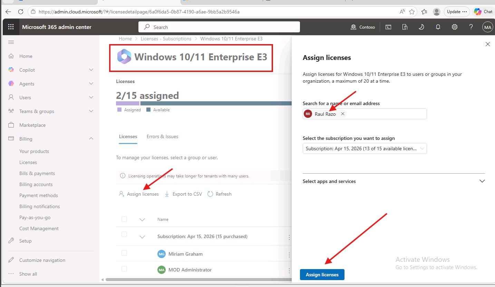

> The subscription shows 13 of 15 available — 2 already assigned to other users. The "Select apps and services" section allows individual service components within the bundle to be selectively enabled or disabled per user.

---

### Step 5 — License Assignment Confirmed

I clicked **Assign licenses**.

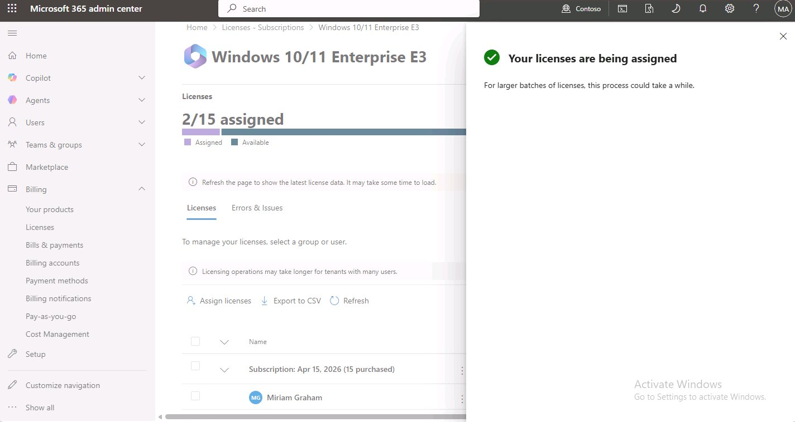

> "Your licenses are being assigned." License assignment is asynchronous — the request is queued and backend processing completes shortly after. The subscription counter updated to 2/15.

---

### Step 6 — Verify the License in Microsoft Entra ID

I switched back to `entra.microsoft.com` and navigated to **Raul Razo → Licenses**.

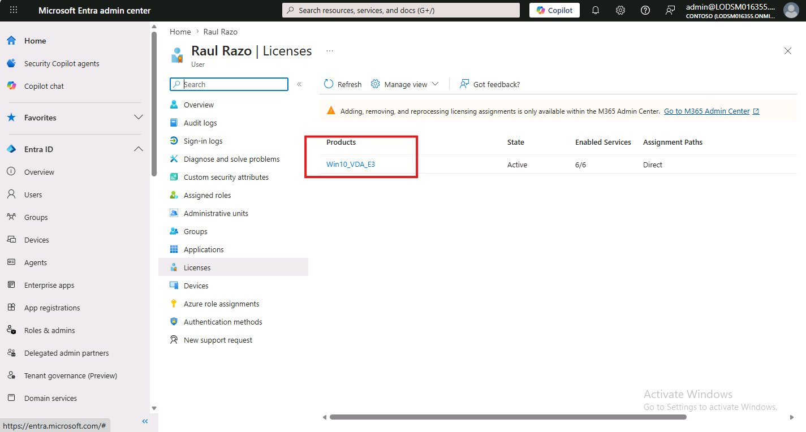

| Field | Value | What It Means |
|---|---|---|
| **Product** | `Win10_VDA_E3` | Internal SKU for Windows 10/11 Enterprise E3 |
| **State** | Active | Fully applied, all services enabled |
| **Enabled Services** | 6/6 | All 6 services in the bundle are enabled for Raul |
| **Assignment Path** | Direct | Assigned individually, not inherited from a group |

> The yellow banner reads: *"Adding, removing, and reprocessing licensing assignments is only available within the M365 Admin Center."* — Entra ID confirming it can display license state but cannot manage it.
>
> **Assignment Path: Direct** matters. In a large organisation, group-based licensing is more scalable — the license is assigned to a group and every member inherits it automatically. The path would then show `Group` rather than `Direct`.

---

### What I Practiced and Demonstrated

- Understanding why license management is separate from identity management
- Verifying the Usage Location prerequisite before attempting assignment
- Navigating to the correct license SKU in M365 Admin Center and assigning it
- Understanding asynchronous license processing
- Verifying a license in Entra ID — interpreting State, Enabled Services, and Assignment Path
- Understanding the difference between Direct and Group-based license assignment

---

## 🧠 What I Learned

**Least privilege is a default, not a configuration.**
Every new account starts with zero permissions. The burden is on the administrator to deliberately grant access — not to restrict it after the fact. That inversion changes how you think about identity administration completely.

**The portal UI is a live mirror of the access model.**
When I assigned Chris Green the Application Administrator role, the locked interface changed within seconds — no re-login required. Entra ID checks authorisation continuously against the live directory, not from a cached session token. Role changes take effect almost immediately.

**PIM is accountability infrastructure, not bureaucracy.**
The justification field, timestamps, and activation logs create a permanent, traceable chain of accountability. In a regulated environment this is how you prove your privileged access management is working — not by claiming to follow least privilege, but by showing the audit trail.

**Microsoft Graph is the foundation under everything.**
Portal click or PowerShell command — both call Microsoft Graph. Once I understood this, the two stopped feeling like separate skills. The portal is for humans making individual decisions. PowerShell is for humans automating repeating ones. Same system underneath.

**The Object ID is the real identity of a user.**
UPNs, display names, and departments can all change. The Object ID assigned at creation never does. When I restored Chris Green, his Object ID was unchanged — which is why all his group memberships and app relationships came back with him. Every external system integrating with Entra ID should reference Object IDs.

**The 30-day soft-delete window has a hard deadline.**
The permanent deletion date is visible in the portal. After that date, recovery is impossible — a new account with the same UPN gets a brand-new Object ID with none of the previous account's history. Knowing this window exists and watching the deadline is the difference between a recoverable incident and an unrecoverable one.

**License management and identity management are intentionally separate.**
Entra ID handles who you are. M365 Admin Center handles what software you have. They overlap visually but not functionally. Knowing which portal owns which function prevents wasted time and silent failures.

**Usage Location is not optional even when it looks optional.**
A user without a Usage Location set cannot receive a license. Microsoft must know the country to apply correct regional commercial terms. Not setting it before attempting assignment is a silent failure mode that is easy to miss if you do not know to look for it.

---

## ⚡ PowerShell Quick Reference

```powershell
# ── Check PowerShell version ──────────────────────────────────
$PSVersionTable.PSVersion

# ── Install PowerShell 7 via winget ───────────────────────────
winget install --id Microsoft.PowerShell --source winget

# ── Install and verify Microsoft.Graph module ─────────────────
Install-Module Microsoft.Graph -Scope CurrentUser -Verbose
Get-InstalledModule Microsoft.Graph

# ── Authenticate to Microsoft Graph ───────────────────────────
Connect-MgGraph -Scopes "User.ReadWrite.All"

# ── List all users in the tenant ──────────────────────────────
Get-MgUser

# ── Get a specific user ───────────────────────────────────────
Get-MgUser -Filter "displayName eq 'Chris Green'"

# ── Define a password profile ─────────────────────────────────
$PWProfile = @{
    Password                      = "YourP@ssword123!"
    ForceChangePasswordNextSignIn = $false
}

# ── Create a new user ─────────────────────────────────────────
New-MgUser `
    -DisplayName       "New PW User" `
    -GivenName         "New" -Surname "User" `
    -MailNickname      "newuser" `
    -UsageLocation     "US" `
    -UserPrincipalName "newuser@yourtenant.onmicrosoft.com" `
    -PasswordProfile   $PWProfile `
    -AccountEnabled    $true `
    -Department        "Research" `
    -JobTitle          "Trainer"

# ── Assign a role via Graph ───────────────────────────────────
$user   = Get-MgUser -Filter "displayName eq 'Chris Green'"
$roleId = (Get-MgDirectoryRole | Where-Object {
    $_.DisplayName -eq "Application Administrator"
}).Id
New-MgDirectoryRoleMember -DirectoryRoleId $roleId `
    -OdataId "https://graph.microsoft.com/v1.0/directoryObjects/$($user.Id)"

# ── Soft-delete a user ────────────────────────────────────────
Remove-MgUser -UserId $user.Id

# ── Restore a soft-deleted user ───────────────────────────────
Restore-MgDirectoryDeletedItem -DirectoryObjectId $user.Id

# ── List soft-deleted users ───────────────────────────────────
Get-MgDirectoryDeletedItemAsUser
```

---

## ✅ Lab Completion Record

| # | Exercise | What I Did | Result |
|---|---|---|---|
| 1 | Create User | Created ChrisG, verified zero default access from his own session | ✅ |
| 2 | Assign Role | Application Administrator via PIM — Active / Permanent / Justified, live verified | ✅ |
| 3 | Remove Role | Removed via Roles & Administrators blade — role-centric approach | ✅ |
| 4a | Bulk CSV | 10 users imported via SC300BulkUser.csv — all Status: Success | ✅ |
| 4b | PowerShell | PS 7.6.1 + Microsoft.Graph + New-MgUser — user created and confirmed in portal | ✅ |
| 5 | Delete & Restore | Soft-deleted ChrisG, restored from Deleted users bin, reset password | ✅ |
| 6 | License | Win10_VDA_E3 assigned to Raul Razo — Active, 6/6 services, Direct | ✅ |

---

<div align="center">

[](https://learn.microsoft.com/en-us/certifications/exams/sc-300)
[](https://learn.microsoft.com/en-us/entra/identity/role-based-access-control/permissions-reference)
[](https://learn.microsoft.com/en-us/entra/id-governance/privileged-identity-management/)
[](https://aka.ms/graph/sdk/powershell)

<br/><br/>

*Lab environment: Contoso · `LODSM016355.onmicrosoft.com` · Completed May 2026*


</div>
